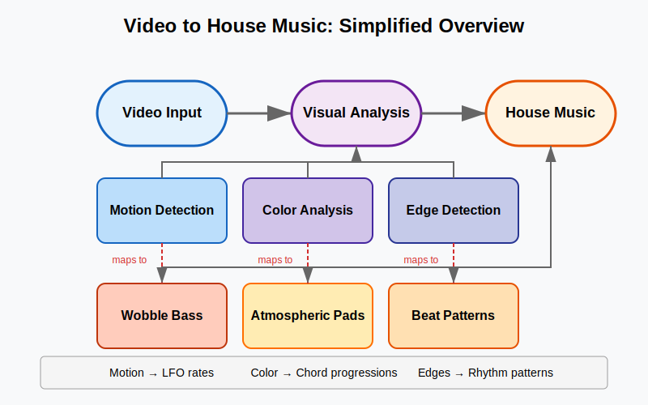
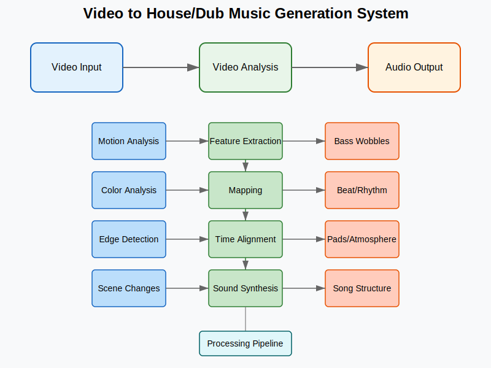
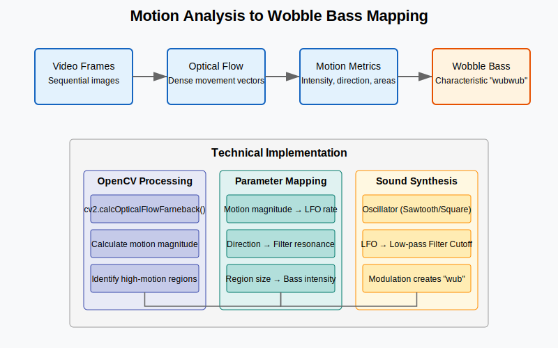
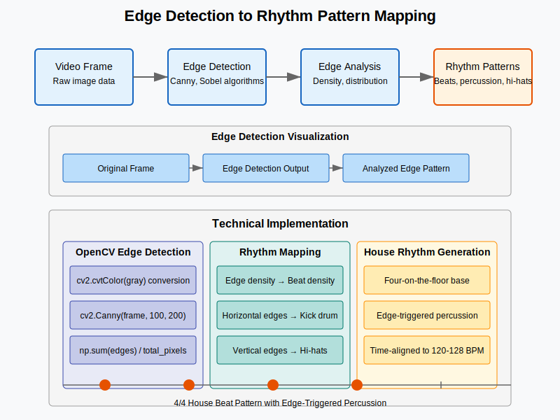

# Video Sonification Project

Transform video content into dynamic house/dub music with characteristic "wubwub" bass sounds. This project analyzes video frames for motion, color, and edges, then maps these visual elements to musical parameters.



## Project Vision

This system converts visual information into musical elements:
- **Motion detection** → Wobble bass modulation
- **Color analysis** → Harmonic elements and chord progressions
- **Edge detection** → Rhythm patterns and percussion

The result is a unique audio experience that directly reflects the visual content of your videos.

## System Architecture

The project follows a microservices architecture with three main components:

1. **Frontend** (React/Vite)
   - User interface for video upload/capture
   - Visual analysis visualization
   - Audio playback controls
   - Parameter adjustment interface

2. **Microservices**
   - Specialized services for different processing needs
   - Containerized for easy deployment
   - Service-specific processing logic

3. **Thrift Interface Layer**
   - Defines service APIs using Apache Thrift
   - Ensures consistent communication between components
   - Language-agnostic service definitions



## Key Technical Components

### Video Analysis Pipeline

Video frames undergo multiple analysis techniques:

1. **Motion Analysis**
   - Optical flow detection using OpenCV
   - Motion intensity and direction metrics
   - High-motion region identification
   - Maps to wobble bass parameters (LFO rate, filter settings)

   

2. **Color Analysis**
   - Dominant color extraction
   - RGB to HSV color space conversion
   - Color change tracking
   - Maps to harmonic elements (chord progressions, pad sounds)

3. **Edge Detection**
   - Canny edge detection algorithm
   - Edge intensity and distribution analysis
   - Edge pattern change tracking
   - Maps to rhythm patterns (hi-hats, percussion)

   

### Audio Generation

The system produces house/dub style music with:

1. **Wobble Bass Generator**
   - Bass synthesizer with LFO modulation
   - Filter modulation for "wubwub" effect
   - Motion-driven parameter mapping

2. **Rhythm Generation**
   - Four-on-the-floor kick pattern base
   - Edge-triggered hi-hats and percussion
   - Visual feature-linked variations

3. **Atmospheric Elements**
   - Pad synthesizer with reverb/delay
   - Color-driven chord progressions
   - Ambient texture generation

## Technology Stack

- **Frontend**: React, Vite, Web Audio API, Canvas/WebGL
- **Backend Services**: 
  - Go service for high-performance processing
  - Python service for ML-based analysis
- **Infrastructure**: Docker, docker-compose
- **Communication**: Apache Thrift
- **Video Processing**: OpenCV, WebRTC
- **Audio Synthesis**: Web Audio API, Tone.js

## v0.0.1 Development Roadmap

The initial version focuses on establishing the basic pipeline:

1. **Simple Interface Development**
   - Video upload functionality
   - Camera capture integration
   - Basic video playback controls

2. **Core Pipeline Setup**
   - Video frame extraction
   - Preliminary visual feature detection
   - Basic audio parameter mapping

3. **Minimal Audio Generation**
   - Simple bass sound with video-driven modulation
   - Basic rhythm pattern generation
   - Rudimentary atmospheric elements

4. **User Controls**
   - Parameter adjustment sliders
   - Audio mute/volume controls
   - Processing on/off toggles

## Getting Started

### Prerequisites

- Node.js (see frontend/.nvmrc for version)
- Docker and docker-compose
- Go (for local microservice development)
- Python 3.8+ (for local microservice development)

### Installation

1. Clone the repository:
   ```
   git clone [repository-url]
   cd video_sonification
   ```

2. Start the development environment:
   ```
   docker-compose up
   ```

3. Access the application:
   ```
   http://localhost:3000
   ```

## Development Approach

This project uses a modular architecture to allow parallel development of components:

1. **Frontend Development**
   - Located in `frontend/`
   - React/Vite application
   - Handles UI, visualization, and audio playback

2. **Microservices Development**
   - Located in `microservices/`
   - Specialized services for different processing needs
   - Each service has its own Dockerfile

3. **API Interface Definitions**
   - Located in `thrift/`
   - Define service APIs using Apache Thrift
   - Generate client/server code for different languages

## Contributing

Contributions are welcome! See [CONTRIBUTING.md](CONTRIBUTING.md) for guidelines.

## License

This project is licensed under the terms of the LICENSE file included in the repository.

## Acknowledgments

- OpenCV for video processing capabilities
- Web Audio API for audio synthesis
- Apache Thrift for service communication