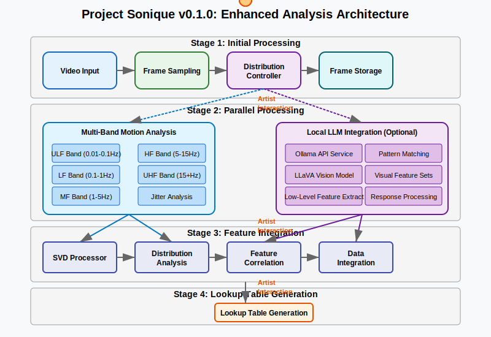

# Project Sonique: Multi-dimensional Video-to-Music System

Transform video content into sophisticated electronic music through pattern analysis across multiple frequency domains. Project Sonique identifies fundamental patterns in motion, color, and form, abstracting them into musical parameters through a multi-stage pipeline with artist intervention.



## Project Vision

Project Sonique uses multi-dimensional pattern analysis rather than semantic object recognition to create authentic connections between visual and auditory domains:

- **Multi-Band Motion Analysis** → Maps frequency-specific motion patterns (0.01Hz-50Hz) to musical parameters
- **Pattern Abstraction & Transformation** → Creates higher-order structures from fundamental patterns
- **Sonification Parameter Mapping** → Translates patterns to comprehensive audio parameter matrices
- **Audio Generation & Refinement** → Produces professional-grade electronic music with characteristic wobble bass

The result is a powerful tool for electronic music producers seeking new sources of inspiration with deep control over the translation process.

## System Architecture

Project Sonique employs a hybrid microservice architecture with both frontend and backend components:

### 1. Frontend Microservices (React/Vite)

Each frontend microservice focuses on a specific domain while sharing data through a common context system:

- **Video Analysis Dashboard**
  - Video upload/capture interface
  - Multi-band visualization components
  - TensorFlow.js for real-time lightweight analysis
  - WebGL-powered frequency domain visualizations

- **Pattern Explorer**
  - Interactive pattern classification interface
  - Mathematical transformation tools
  - Pattern relationship visualization
  - Template management system

- **Audio Parameter Mapper**
  - Comprehensive mapping matrix editor
  - Transfer function design interface
  - Parameter relationship visualization
  - Preset management system

- **Music Generator**
  - Audio playback controls
  - Synthesis parameter adjustment
  - Stem isolation and mixing
  - DAW export functionality

### 2. Backend Microservices

Specialized processing services with different technology stacks based on requirements:

- **Multi-Band Analysis Service** (Python/NumPy/SciPy)
  - Frequency band decomposition
  - Motion type classification
  - Distribution analysis
  - Mathematical transformations

- **Jitter Analysis Service** (Python/OpenCV)
  - Micro-movement detection
  - Jitter characterization
  - Amplification mapping
  - Sub-pixel tracking

- **LLaVA Integration Service** (Python/Ollama)
  - Semantic analysis of video content
  - Knowledge graph construction
  - Context-aware processing
  - Feature correlation

- **Audio Generation Service** (Python/librosa)
  - Wobble bass synthesis
  - Rhythm generation
  - Harmonic content creation
  - Professional audio export

### 3. Communication Infrastructure

- **NATS Message Broker**
  - Publish-subscribe pattern for event distribution
  - Service discovery and registry
  - Request-reply for synchronous operations
  - Queue groups for load balancing

- **WebSocket Gateway**
  - Real-time bidirectional communication
  - Progress updates and streaming results
  - Live parameter adjustment
  - UI synchronization across components

- **Shared Context System**
  - Distributed state management
  - Security and access control (stubbed)
  - Event notification system
  - Session management

## Key Technical Components

### Multi-Band Motion Analysis Framework

Video motion is analyzed across five frequency bands:

1. **Ultra-Low Frequency (ULF)**: 0.01-0.1 Hz
   - Scene transitions, camera movements, slow evolutions
   - Maps to arrangement structure, musical evolution

2. **Low Frequency (LF)**: 0.1-1 Hz
   - Swaying, drifting motions (like corn swaying in field)
   - Maps to bass fundamentals, filter envelope timing

3. **Mid Frequency (MF)**: 1-5 Hz
   - Regular rhythmic movements (like walking)
   - Maps to wobble LFO rates, rhythm foundations

4. **High Frequency (HF)**: 5-15 Hz
   - Rapid actions, quick transitions
   - Maps to percussion triggers, staccato elements

5. **Ultra-High Frequency (UHF)**: 15+ Hz
   - Vibrations, jitter, micro-movements
   - Maps to texture details, granular synthesis parameters

Within each band, motion is classified into types (Directional, Oscillatory, Chaotic, Ambient) and mapped to audio parameters through a comprehensive Parameter Matrix System.

### Jitter Analysis System

Specialized analysis for micro-movements and subtle variations:

- **Detection Pipeline**: High-pass filtering of motion vectors, sub-pixel tracking
- **Characterization**: Frequency spectrum analysis, spatial distribution mapping
- **Amplification**: User-controlled enhancement curves, non-linear transformations

### Vector Field Decomposition

Matrix operations for efficient motion representation and processing:

- **SVD Processing**: Motion vector field decomposition, principal component extraction
- **Tensor Representation**: Multi-dimensional encoding of pattern data
- **Field Operations**: Transformation matrices for pattern manipulation

### Wobble Bass Generator

Professional-grade bass synthesis engine:

- **Multi-oscillator Engine**: Layered synthesis for complex timbres
- **LFO Modulation System**: Multi-stage LFO routing directly linked to motion patterns
- **Filter Processing Chain**: Dynamic resonance control, motion-driven modulation

## Technology Stack

- **Frontend**: React, Vite, WebGL, TensorFlow.js, Tone.js, Module Federation
- **Backend Services**: 
  - Python with NumPy, SciPy, librosa for analysis and synthesis
  - Ollama/LLaVA for semantic understanding
- **Infrastructure**: Docker/Kubernetes with NVIDIA CUDA support
- **Communication**: NATS Message Broker, WebSockets, gRPC
- **Processing**: OpenCV, FFT libraries, distributed computing
- **Data Management**: Redis for caching, SQLite for local storage

## Development Roadmap

### Phase 1: Infrastructure & Foundation (Current Focus)

1. **Microservice Architecture Setup**
   - Containerization with GPU support
   - NATS message broker integration
   - Shared context/tagging system
   - Service communication protocols

2. **Multi-Band Motion Analysis Framework**
   - Frequency band decomposition implementation
   - Motion type classification system
   - Basic pattern detection pipeline
   - Visualization components

3. **Frontend Micro-Frontend Architecture**
   - Module federation implementation
   - Shared context providers
   - Component library development
   - Basic UI implementation

4. **Prototype Workflow Integration**
   - End-to-end pipeline testing
   - Basic parameter mapping
   - Simple audio generation
   - User feedback collection

### Phase 2: Advanced Analysis & Transformation

1. **Enhanced Motion Analysis**
   - Complete multi-band analysis pipeline
   - Sophisticated pattern classification
   - Jitter analysis system
   - Vector field operations

2. **Mathematical Transformation System**
   - Non-linear transformations
   - Differential pattern analysis
   - Integration and accumulation
   - Pattern relationship modeling

3. **LLaVA Integration**
   - Semantic understanding setup
   - Knowledge graph construction
   - Multi-modal data alignment
   - Feature correlation analysis

4. **Lookup Table Generation**
   - Motion distribution tables
   - Semantic feature tables
   - Parameter mapping templates
   - Temporal structure templates

### Phase 3: Audio Generation & Refinement

1. **Wobble Bass Generator**
   - Multi-oscillator engine
   - LFO modulation system
   - Filter processing chain
   - Pattern-driven parameter control

2. **Rhythm Generation System**
   - Beat construction engine
   - Percussion synthesis
   - Groove and timing engine
   - Motion-driven variations

3. **Harmonic and Melodic System**
   - Chord progression generator
   - Melodic pattern engine
   - Atmospheric sound design
   - Structural organization

4. **Audio Export & Integration**
   - DAW-compatible export formats
   - Stem separation
   - Metadata embedding
   - External tool integration

## Getting Started

### Prerequisites

- Node.js (see frontend/.nvmrc for version)
- Docker and docker-compose with NVIDIA container toolkit
- NVIDIA GPU with CUDA support (recommended)
- Python 3.8+ (for local microservice development)

### Installation

1. Clone the repository:
   ```
   git clone [repository-url]
   cd video_sonification
   ```

2. Start the development environment:
   ```
   docker-compose up
   ```

3. Access the application:
   ```
   http://localhost:3000
   ```

## Development Approach

This project uses a microservice architecture with the following organization:

1. **Frontend Microservices**
   - Located in `frontend/services/`
   - Each has its own container and can be developed independently
   - Share common libraries through `frontend/lib/`

2. **Backend Microservices**
   - Located in `microservices/`
   - Specialized services with their own technology stacks
   - Each service has its own Dockerfile

3. **Shared Components**
   - Located in `shared/`
   - Common types, interfaces, and utilities
   - Cross-service schemas and protocols

4. **Infrastructure Configuration**
   - Located in `infra/`
   - Kubernetes manifests
   - Service mesh configuration
   - Monitoring and observability setup

## EDM Production Workflow

Project Sonique integrates with electronic music production workflows in these stages:

1. **Video Selection & Analysis**
   - Upload or capture video content
   - Explore multi-band patterns
   - Select interesting visual elements

2. **Pattern Exploration & Transformation**
   - Examine pattern abstractions
   - Apply mathematical transformations
   - Select patterns for musical mapping

3. **Parameter Mapping Configuration**
   - Define relationships between patterns and audio parameters
   - Configure transfer functions
   - Create mapping templates

4. **Audio Generation & Refinement**
   - Generate audio based on mappings
   - Adjust synthesis parameters
   - Refine the musical output

5. **Export & Production Integration**
   - Export stems or complete tracks
   - Import into DAW for further production
   - Use as inspiration or as finished elements

## Contributing

Contributions are welcome! See [CONTRIBUTING.md](CONTRIBUTING.md) for guidelines.

## License

This project is licensed under the terms of the LICENSE file included in the repository.

## Acknowledgments

- Signal Processing techniques adapted from audio and image processing research
- Inspiration from EDM production workflows and tools
- Pattern analysis approaches from computer vision and machine learning domains